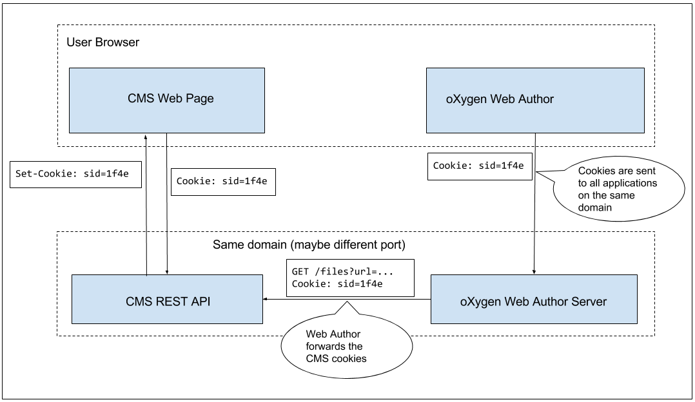

REST API for CMS-es
===================

Assumptions
-----------

This plugin has several assumptions about the implementation of the API:

1. The REST API is deployed on the same domain as Web Author (maybe on different ports). Below we will denote:
 - the base URL of the REST API as `$BASE_URL`. An example value would be: `http://example.com/oxygen-cms/v1/`
 - the base URL of Web Author as `$WEB_AUTHOR_URL`. An example value would be `http://localhost:8080/oxygen-xml-web-author/app/oxygen.html`.
2. The API requests are authenticated using cookies.

The resulting architecture would look like in the image below:



These are not hard requirements but meeting them greatly simplifies the integration.

Error responses
---------------

When the requests are made without the required cookies or with expired ones, the `401` (Not Authenticated) HTTP status code must be returned.

If an error occured while processing the request, the API can return an error status code: `4XX` or `5XX`. The body of the response whould be a JSON message with the following format:

```Javascript
{
  "message": "Cannot process request due to ... "
}
```


Basic file operations
---------------------

Each file is identified by an URL with the `rest://` scheme. The file URL should be percent encoded when used as a query parameter.

| Action   | Endpoint  |
|----------|-----------|
| *Open*   | GET    `$BASE_URL`/files?url=file_url  |
| *Save*   | PUT    `$BASE_URL`/files?url=file_url  |
| *Upload* | POST   `$BASE_URL`/files?url=file_url  |
| *Delete* | DELETE `$BASE_URL`/files?url=file_url  |

The file content encoding should be `UTF-8` in both requests and responses of these endpoints.

User Authentication
-------------------

One solution is to embed Web Author in a page of your application and make sure that the user is authenticated before opening the editor.

However, if you choose to allow users to open Web Author independently of your application, or if you use expiring login sessions, the user may need to re-login during an editing session.

To implement this re-login flow you should do the following:

1. When Web Author connects to the API using no cookies or expired cookies, return `401` status code. 
2. Implement the following HTTP endpoint to show a login form to the user.

  ```
  $BASE_URL/login
  ```

  **Hint**: you can redirect her to your existing login form.
3. After the user logs in, your should redirect her to 
  ```
  $WEB_AUTHOR_URL/plugins-dispatcher/rest-login-callback
  ```

File browsing
-------------

Some of the editing actions require the user to browse for a file in the CMS (e.g. when inserting an image) or for an element inside an XML document (inserting a cross reference). To present a browsing widget to the user in these cases there are two options.   

### Folder-based browsing widget

If your file URLs have an hierarchical structure, you can use the default file browsing widget by implementing the following REST endpoint:

| Action   | Endpoint  |
|----------|-----------|
| *List Folder*     | GET `$BASE_URL`/oxygen-cms/v1/folders?url=folder_url  |

The response should be a JSON array of objects with the following format:

```javascript
[{"name": "file.ditamap", "folder": false}, {"name": "topics/", folder: true}]
```

### Custom file browsing widget

In some cases, the files do not have a hierarchical folder structure, and the user can rely on labels or full text search to find content. In this case, you can register a custom file browsing widget.

When the user needs to choose an URL of a CMS resource, the folloing URL will be open for her:
```
$BASE_URL/browse
```

After the user chose the resource URL, your job is to redirect her to 
```
$WEB_AUTHOR_URL/plugins-dispatcher/rest-browse-callback?url=rest://chosen_url
```
